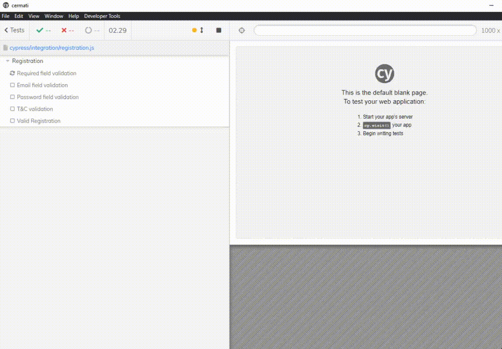
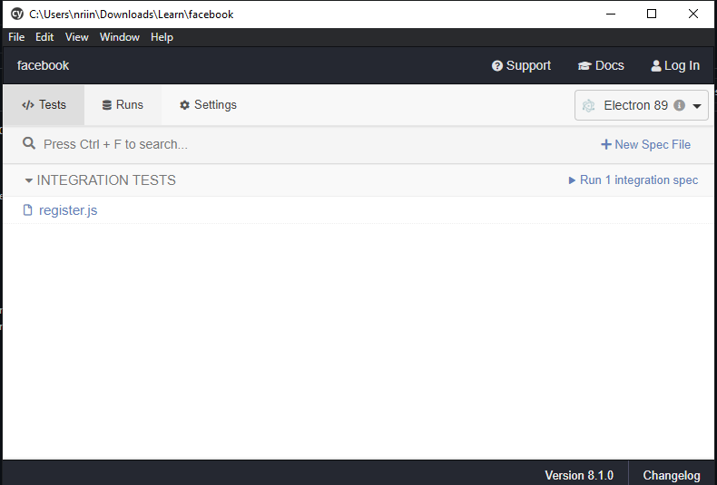
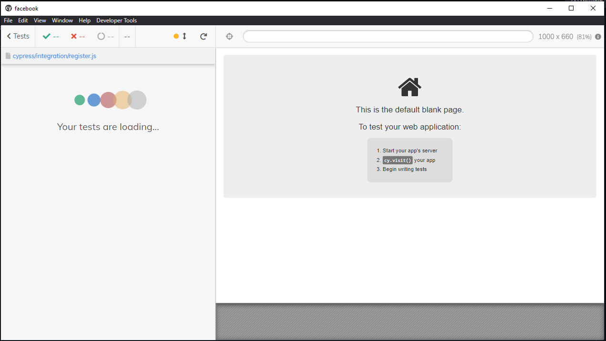
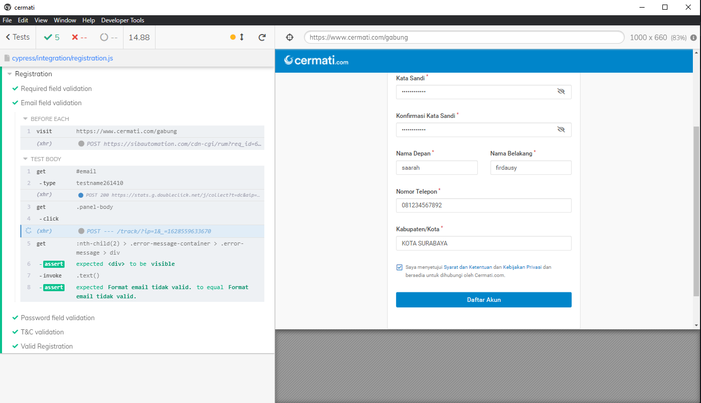

# Q4 AUTOMATE TEST USING CYPRESS
---

## *prequisites*
install cypress using npm

    npm install cypress --save-dev

run the cypress

    nppx cypress run

It will looked like below

Click the test you want to run, example: [Registration test case](./cypress/integration/registration.js)

Choose electron as the environment browser

